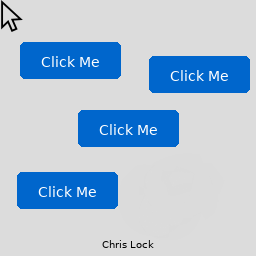

# Real-time AI UI Demo

A proof-of-concept project demonstrating a real-time AI that "imagines" and renders a graphical user interface frame-by-frame based solely on the previous frame, mouse position, and click state. Inspired by OasisAI's Minecraft world model, this system uses a simple autoencoder+predictor pipeline to generate UI frames without any hard-coded logic—behavior is entirely learned from training data. In the future, this approach could be extended to imagine multi-layered websites and complex interfaces from only a handful of design snapshots.

## Demo

The system learns to respond to mouse movements and clicks, generating realistic UI behavior frame-by-frame. In this demo, you can see the button responding to interactions, and even some fun "breaking" of the interface when pushed to its limits:


*The AI learns UI behavior patterns from training data and generates frames in real-time based on cursor position and click state.*

---

## Strange Initialisation Experiments

What happens when you start the AI with a completely messed up initial frame? Has the model generalised on any of its training data? I tried initialising with a heavily altered UI covered in buttons everywhere, and the results were (in my humble opinion) mind-blowing:



*The chaotic initial frame I used to start the experiment*


*Starting with chaos reveals how the AI has learned real abstract UI logic.*

### Stable button states until interaction

The scattered buttons would remain relatively stable until my cursor got near them. At this point, they would spontaneously deform. The cursor itself became unstable around these phantom buttons but stayed normal when far away. It's like the buttons created fields of uncertainty.

### Generalised button logic everywhere

Even with multiple buttons scattered across the screen, they all exhibited proper behavior; blue normally, light blue on hover, pink on click, complete with curved corners. When a button was "complete enough," clicking it would actually make "PRESSED" appear above it (or it attempted it anyway)! This happened even when the button was nowhere near its training position. The model genuinely learned the logic: button-looking thing + click = show "pressed" text.

### Mysterious stable deformations

Some buttons would deform into these weird square versions—no text, but still acted like buttons. These seemed to be some kind of stable attractor state that was difficult to remove. I have no idea why these appear since nothing like them existed in the training data. Maybe it's something about the architecture creating these stable configurations?

### Linked vs independent button logic

Here's the weirdest part: when there were multiple deformed square buttons, they'd all be linked; click one and they'd all turn pink together. But when some buttons looked close enough to the real training button, those would act independently with proper individual logic and their own "PRESSED" text.

The model didn't just memorise pixels; it learned the actual UI concepts and logic that it can apply in "completely novel" situations.

---

## Under the Hood: The Weird and Wonderful

Ok so I've been obsessing over some of the bizarre behaviors that emerged while building this thing:

### Psychedelic latent drift

Why do uniform background tiles develop these shifting RGB "blobs" over time? Turns out it's just small prediction errors accumulating. Each frame adds tiny imperfections in latent space and they compound into these trippy drifts. It's like watching the AI's uncertainty leak out as abstract art.

### Coordinate channels' role

I'm feeding normalized (x,y) info into the predictor and instead of getting flat boring fills, there are these subtle gradients everywhere. The model learned that position matters and creates these natural spatial variations. Way cooler than I expected.

### Cursor-anchored flatness

This is the part that blew my mind—the cursor mask acts as a hard reset. Wherever the pointer lands, the model re-generates that tile crisply, overriding all the accumulated latent noise. So it stays flat and clean under your sprite while everything else might be drifting into psychedelic territory. Your mouse is literally an anchor of sanity.

### Emergent button behavior everywhere

Here's where it gets really wild—even when the model starts hallucinating and creates fake buttons in random places, those faux buttons still behave exactly like the real one. Same curved corners, blue normally, light blue on hover, pink on click. The pressing logic works no matter where on screen these phantom buttons appear, even though the training data only had the button in one correct position. The model somehow learned the abstract concept of "button-ness" and can apply it anywhere.

### Signature drift but persistent identity

My signature at the bottom would shift and warp when the mouse moved over it, but it always tried to write my name. The letters might get distorted or repositioned, but the model never forgot what it was supposed to say. It's like watching someone with shaky hands still trying to sign their name—the intent remains even when the execution gets wobbly.

These aren't bugs, they're glimpses into how the thing actually "thinks".

---

## Features

- **Synthetic UI generator**– Renders a window (256×256 px), button, cursor sprite, and dynamic text.– Generates aligned triplets: previous frame, cursor position mask, click state mask, next frame.
- **Autoencoder-based compression**– Trains a convolutional autoencoder (AE) to encode/decode UI frames (16×16 latent).
- **Latent-space frame predictor**– A TinyUNet learns to roll out future latent representations given cursor & click inputs.
- **Real-time interactive demo**– PyGame application for live inference: move/click to see AI-generated UI react.
- **Data preparation & evaluation**
  – Scripts to generate synthetic episodes, prepare latent datasets, and visualise reconstructions/predictions.

---

## Running the Pretrained Model

To run the real-time demo using the pretrained models provided in the repository, follow these steps:

1. Ensure you have the following files:

   - Encoder: `models/ae_v4/ae_encoder.pt`
   - Decoder: `models/ae_v4/ae_decoder.pt`
   - Predictor: `models/predictor_v1/predictor.pt`
2. Launch the real-time interactive demo:

   ```bash
   python scripts/realtime_demo.py \
     --encoder_pt models/ae_v4/ae_encoder.pt \
     --decoder_pt models/ae_v4/ae_decoder.pt \
     --predictor_pt models/predictor_v1/predictor.pt \
     --zdim 64
   ```

   Move and click in the window to see the AI-generated UI react in real time.

---

## Requirements

- **Python** 3.8+
- **CUDA** toolkit (if using GPU acceleration)
- All other Python dependencies are pinned in `requirements.txt`

---

## Installation

1. **Clone** the repository:

   ```bash
   git clone https://github.com/chrislovescoding/ai_ui_project.git
   cd ai_ui_project
   ```
2. **Install dependencies** :

```bash
   pip install --upgrade pip
   pip install -r requirements.txt
```

2. **Verify assets** : ensure the following files exist:

* `assets/DejaVuSans.ttf`
* `assets/cursor.png`

2. **Generate synthetic data** :

```bash
   python -m src.data_generation.run_generation
```

   This uses `assets/design_spec.yaml` to render UI episodes under the configured output directory.

---

## Training

### 1. Train Autoencoder

```bash
python -m src.train_autoencoder \
  --data_root path/to/exhaustive_data/images \
  --out_dir models/ae_v4 \
  --epochs 50 \
  --warmup_epochs 5 \
  --zdim 64 \
  --batch 256 \
  --lr 3e-4 \
  --l1_weight 0.1 \
  --psnr_target 40.0
```

### 2. Prepare Latent Dataset

```bash
python scripts/prepare_latent_dataset.py \
  --episodes-root path/to/generated/episodes \
  --encoder-pt models/ae_v4/ae_encoder.pt \
  --out latent_triplets
```

### 3. Train Predictor

```bash
python -m src.train_predictor \
  --data latent_triplets \
  --out models/predictor_v1 \
  --epochs 30 \
  --batch 256 \
  --zdim 64 \
  --lr 1e-3
```

---

## Evaluation & Visualisation

* **Reconstruction tests** :

```bash
  python scripts/test_autoencoder.py \
    --data_root path/to/exhaustive_data/images \
    --encoder_pt models/ae_v4/ae_encoder.pt \
    --decoder_pt models/ae_v4/ae_decoder.pt \
    --zdim 64 \
    --num 10
```

* **Prediction tests** :

```bash
  python scripts/test_predictor.py \
    --npz_folder latent_triplets \
    --encoder_pt models/ae_v4/ae_encoder.pt \
    --decoder_pt models/ae_v4/ae_decoder.pt \
    --predictor_pt models/predictor_v1/predictor.pt \
    --zdim 64 \
    --num 5
```

* **Create GIFs** from a set of episodes:
  ```bash
  python scripts/create_gifs.py --input_dir path/to/episodes --output_dir data_gifs
  ```

---

## Future Directions

* **Generalised UI imagination** : scale beyond a single button to multi-layered websites, dynamic menus, and forms.
* **Self-supervised pretraining** : learn from real UI screenshots to boost realism.
* **Guided generation** : incorporate high-level user intents to steer frame-by-frame outputs.

---
